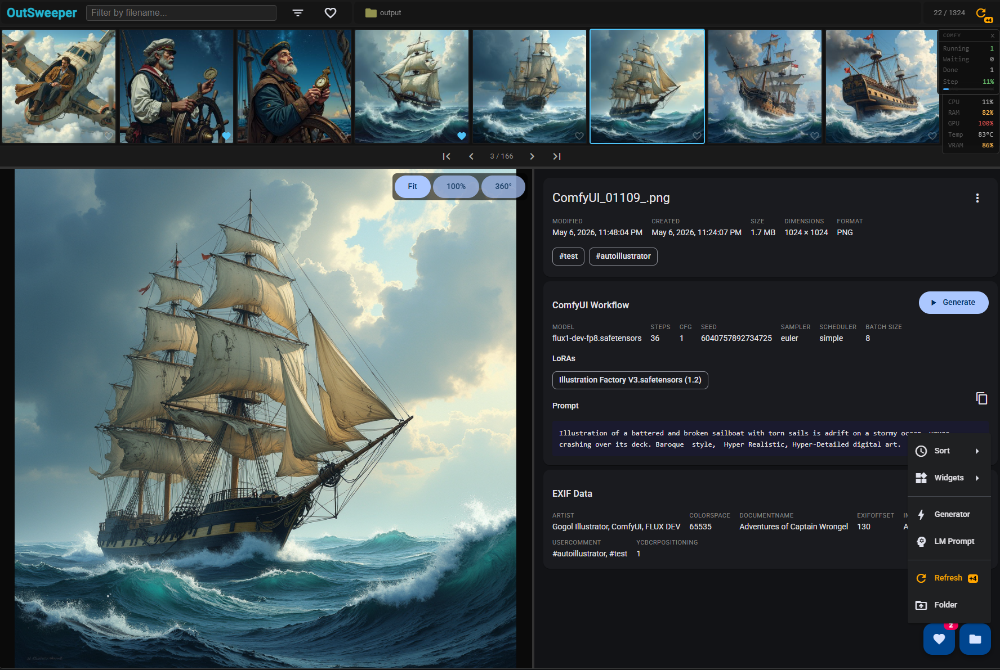

# OutSweeper

**AI Generation Output Triage for ComfyUI**

A fast, keyboard-driven photo triage tool. Open a folder, browse images in a scrollable strip, and sort them into **selected** or **dust** sub-folders — all without leaving the keyboard. Pairs naturally with ComfyUI and LM Studio for AI-assisted workflows.


## Screenshot




## Features

### Core triage
- Keyboard-first navigation across a horizontal thumbnail strip
- Move photos to `__selected` (keep) or `__dust` (reject) with a single keystroke
- Multi-select with Space / Ctrl+A, then bulk-move the whole selection
- Undo the last move with Ctrl+Z (in-memory stack)
- Filter strip by filename in real time
- Favorites — mark photos with a heart; toggle the strip to show only favorites

### Viewing
- Full-resolution preview panel with mouse-wheel zoom and click-drag pan
- Three view modes: **Fit**, **100%**, **360°** (panoramic scroll)
- Drag-resizable dividers between the strip, info panel, and preview
- Lazy-loaded thumbnails (300 × 300 JPEG cache in `__thumbnails/`, mtime-invalidated)
- Pagination with configurable page size; jump ±10 pages with Shift+PageDown/Up

### Metadata & info panel
- File info: name, modified/created date, size, dimensions, format
- EXIF data extraction (date, GPS, ICC profile, PNG text chunks, ComfyUI workflow)
- ComfyUI workflow details: model, LoRAs, sampler settings, positive prompt, batch size
- Inline EXIF/metadata editor — edit title, artist, description, document name, copyright, user comment (requires ExifTool)
- Batch metadata editing across multiple selected files
- Write AI description to PNG text chunk or JPEG/WebP EXIF `UserComment`

### AI integrations
- **LM Studio** — send a free-form text prompt and get a response; copy or forward to ComfyUI
- **Describe image** — pass the current photo to a vision model (e.g. LLaVA); save description to file metadata
- **Prompt Composer** — build narrative prompts from randomized preset arrays (ambience, character, action, style)
- One-click "Run LM Studio" / "Run ComfyUI" launcher buttons when the service isn't reachable

### ComfyUI integration
- Send the current image's embedded workflow directly to ComfyUI with **Generate**
- Edit any workflow node values before submitting
- Cartesian-product batch generation: pick multiple LoRA / checkpoint variants, generates all combinations
- Live ComfyUI queue monitor widget (Running / Waiting / Done)
- Automatic GPU stats widget: CPU %, RAM %, GPU %, temperature, VRAM %

### File system
- Background file-system watcher — strip auto-refreshes when files are added or removed
- Periodic index validation to catch external changes
- Automatic thumbnail cache cleanup (configurable retention days)
- Folder switcher: source, `__selected`, `__dust`, and the ComfyUI output folder

### Custom tools
- Define shell commands in `config.toml` that run against the current file (`%filename%` placeholder)
- Tools appear as buttons in the info panel

---

## Requirements

| Component | Version |
|---|---|
| Python | 3.11+ (3.10 with `tomli`) |
| Flask | ≥ 3.0 |
| Pillow | ≥ 10.0 |
| requests | ≥ 2.33 |
| psutil | ≥ 5.9 |
| nvidia-ml-py | ≥ 12.0 |
| websocket-client | ≥ 1.6 |
| watchdog | ≥ 4.0 |
| ExifTool | optional, for metadata editing |

---

## Installation

### 1. Clone

```bash
git clone https://github.com/yourname/photo-parser.git
cd photo-parser
```

### 2. Install Python dependencies

```bash
pip install -r requirements.txt
```

### 3. (Optional) ExifTool

Download [ExifTool](https://exiftool.org/) and set its path in `config.toml` under `exiftool_path`. Without it, metadata editing is disabled.

### 4. (Optional) Build the frontend

The `static/` directory is pre-built and committed. Rebuild only if you modify the Angular source:

```bash
cd frontend
npx ng build
```

---

## Running

### Direct

```bash
python app.py <source_folder>
```

The browser opens automatically at `http://localhost:1976`.

### Without a folder argument

If `comfy_output` is set in `config.toml`, calling `python app.py` with no argument opens that folder directly.

### Windows launcher (release build)

```bat
run.bat <source_folder>
```

### Development (live reload)

Run the Flask backend and Angular dev server in two terminals:

```bash
# Terminal 1
python app.py <source_folder>

# Terminal 2
cd frontend
npx ng serve          # proxies /api → localhost:1976
```

App is then at `http://localhost:4200`.

---

## Configuration

Create `config.toml` next to `app.py`. All sections and keys are optional.

```toml
[permissions]
# Allow changing source folder from the UI
allow_dir_change = true

[defaults]
port                  = 1976
selected_dir_name     = "__selected"
dust_dir_name         = "__dust"

# ComfyUI
comfy_url             = "http://127.0.0.1:8188"
comfy_output          = "C:/path/to/ComfyUI/output"
run_comfy_command     = "C:/path/to/run_nvidia_gpu.bat"

# LM Studio
lmstudio_url          = "http://localhost:1234/v1"
run_lmstudio_command  = "C:/path/to/LM Studio.exe"

# ExifTool
exiftool_path         = "exiftool"          # or full path

# Thumbnail cache: delete thumbnails older than N days
thumb_cache_days      = 3

# Seconds between background index re-validation (null = disabled)
index_validation_interval = 600

[parameters]
extract_exif = true   # show EXIF fields in info panel
extract_gps  = false  # show GPS coordinates
extract_icc  = false  # show ICC colour profile info
extract_png  = true   # show PNG text chunks

[widgets]
gpu_monitor = true    # top-right GPU/CPU stats widget
comfy_queue = true    # top-right ComfyUI queue widget

# Custom tools — %filename% is replaced with the full file path
[tools]
"Split to Four" = "python C:/tools/split_tiles.py %filename%"
"Upscale"       = "python C:/tools/upscale.py %filename%"
```

### Config reference

| Key | Default | Description |
|---|---|---|
| `defaults.port` | `1976` | HTTP port |
| `defaults.selected_dir_name` | `__selected` | Sub-folder for kept photos |
| `defaults.dust_dir_name` | `__dust` | Sub-folder for rejected photos |
| `defaults.comfy_url` | `http://127.0.0.1:8188` | ComfyUI API base URL |
| `defaults.comfy_output` | _(empty)_ | ComfyUI output folder; also used as default source if no CLI arg |
| `defaults.run_comfy_command` | _(empty)_ | Shell command to start ComfyUI |
| `defaults.lmstudio_url` | `http://localhost:1234/v1` | LM Studio API base URL |
| `defaults.run_lmstudio_command` | _(empty)_ | Shell command to start LM Studio |
| `defaults.exiftool_path` | `exiftool` | Path to ExifTool binary |
| `defaults.thumb_cache_days` | `3` | Days before stale thumbnails are purged |
| `defaults.index_validation_interval` | _(disabled)_ | Seconds between full index re-checks |
| `parameters.extract_exif` | `true` | Include EXIF fields in the info panel |
| `parameters.extract_gps` | `false` | Include GPS coordinates |
| `parameters.extract_icc` | `false` | Include ICC colour profile |
| `parameters.extract_png` | `true` | Include PNG text chunks |
| `permissions.allow_dir_change` | `true` | Show folder-switch button in UI |
| `widgets.gpu_monitor` | `false` | GPU/CPU stats overlay |
| `widgets.comfy_queue` | `false` | ComfyUI queue overlay |

---

## Keyboard Shortcuts

### Navigation

| Key | Action |
|---|---|
| `→` | Next photo |
| `←` | Previous photo |
| `↑` | Move up one strip row |
| `↓` | Move down one strip row |
| `Home` | First photo |
| `End` | Last photo |
| `Page Down` | Next page |
| `Page Up` | Previous page |
| `Shift + Page Down` | Skip forward 10 pages |
| `Shift + Page Up` | Skip backward 10 pages |

### Triage

| Key | Action |
|---|---|
| `+` | Move current photo to `__selected` |
| `Delete` | Move current photo to `__dust` |
| `Space` | Toggle selection on current photo |
| `Ctrl + A` | Select all visible photos |
| `Ctrl + Z` | Undo last move |

### Other

| Key | Action |
|---|---|
| `=` | Switch source folder (opens folder picker) |
| `Ctrl + S` | Download current photo |

> Keyboard shortcuts are suppressed when a dialog or text input is focused.

---

## Supported Formats

`.png` · `.jpg` · `.jpeg` · `.webp`

---

## Project Structure

```
photo-parser/
├── app.py                  # Entry point: CLI parsing, config loading, server start
├── config.toml             # Local configuration (not committed)
├── requirements.txt
├── server/                 # Flask application package
│   ├── factory.py          # create_app() and all route definitions
│   ├── state.py            # AppState dataclass
│   ├── utils.py            # Image utilities, EXIF extraction, thumbnail cache
│   ├── exiftool.py         # ExifTool integration
│   ├── background.py       # GPU monitor, ComfyUI WebSocket, queue polling
│   ├── events.py           # Server-Sent Events broadcast
│   └── watcher.py          # File-system watcher and index builder
├── frontend/               # Angular 20 source
│   └── src/app/
│       ├── app.ts          # Root component: layout, keyboard, SSE routing
│       ├── components/     # ImageStrip, InfoPanel, PreviewPanel, all dialogs
│       ├── services/       # PhotoService, KeyboardService, ConnectionStateService, …
│       └── models/         # TypeScript interfaces
├── static/                 # Built Angular output (served by Flask)
├── release/                # Windows batch launchers
├── describe.py             # CLI: describe an image with LM Studio
├── gen.py                  # CLI: batch ComfyUI generation from PNG workflows
├── run.py                  # CLI: re-submit PNG workflows with random seeds
└── prompt.py               # CLI: print a single randomised prompt
```

---

## CLI Utilities

| Script | Usage | Description |
|---|---|---|
| `describe.py` | `python describe.py <image> [prompt] [model]` | Describe an image via LM Studio vision API |
| `gen.py` | `python gen.py <folder>` | Batch ComfyUI generation — reads PNG workflows, randomises prompts and seeds |
| `run.py` | `python run.py <folder>` | Re-submits PNG workflows with fresh random seeds |
| `prompt.py` | `python prompt.py` | Prints a single random prompt from preset arrays |

---

## License

MIT
